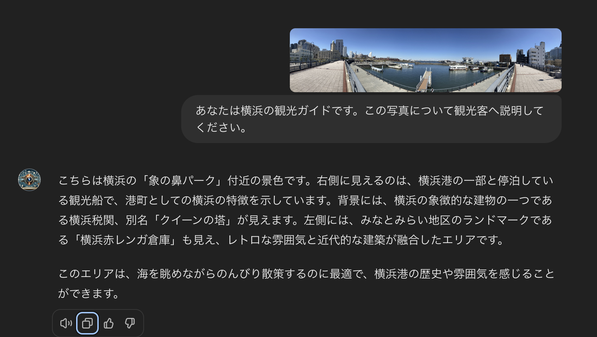
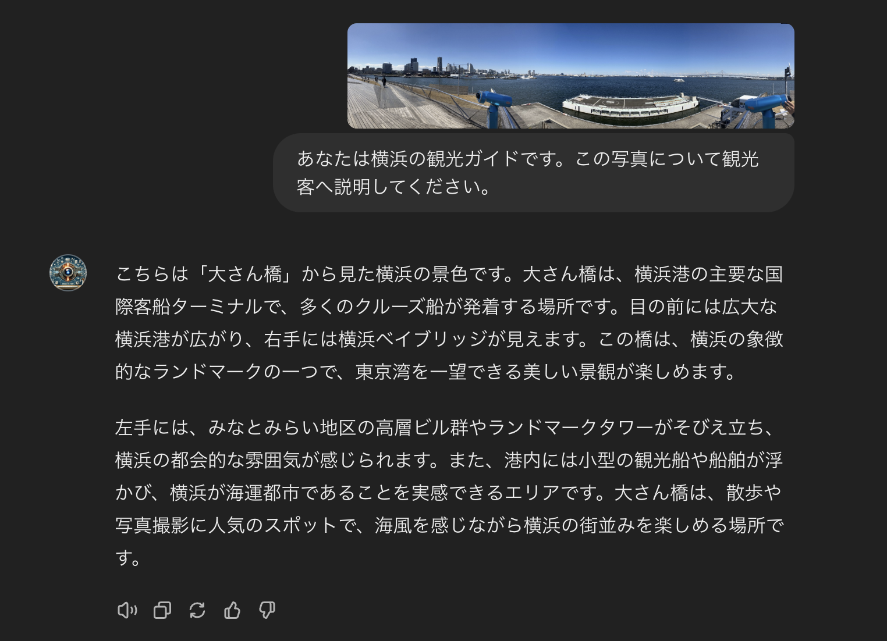
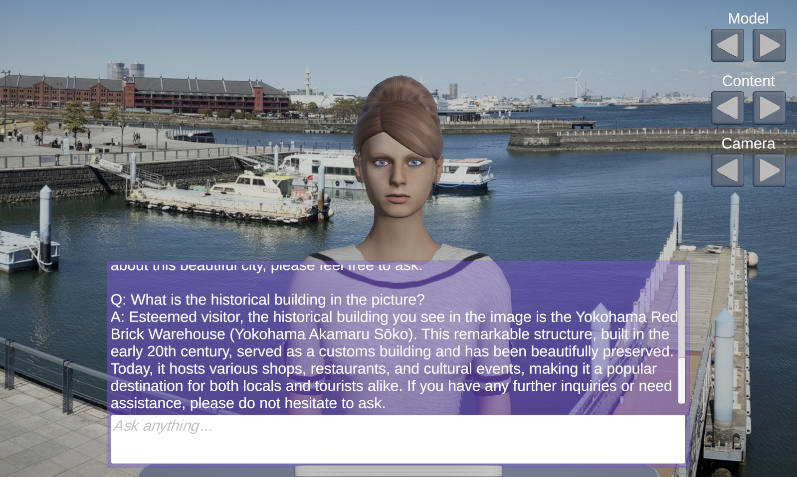
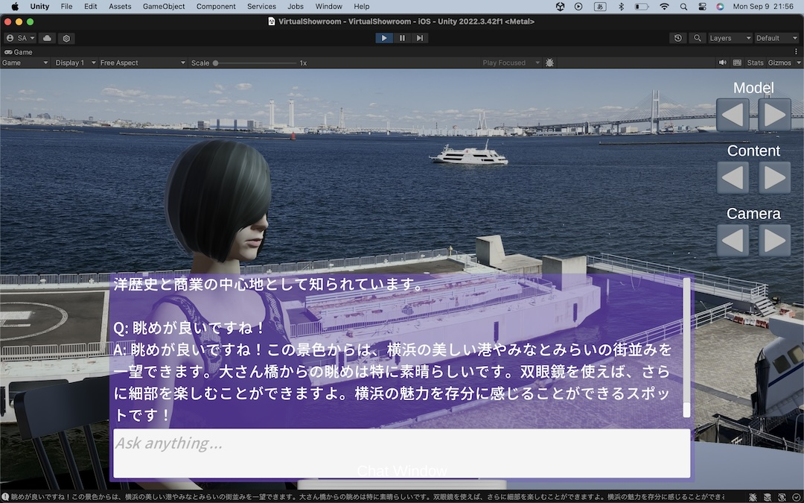
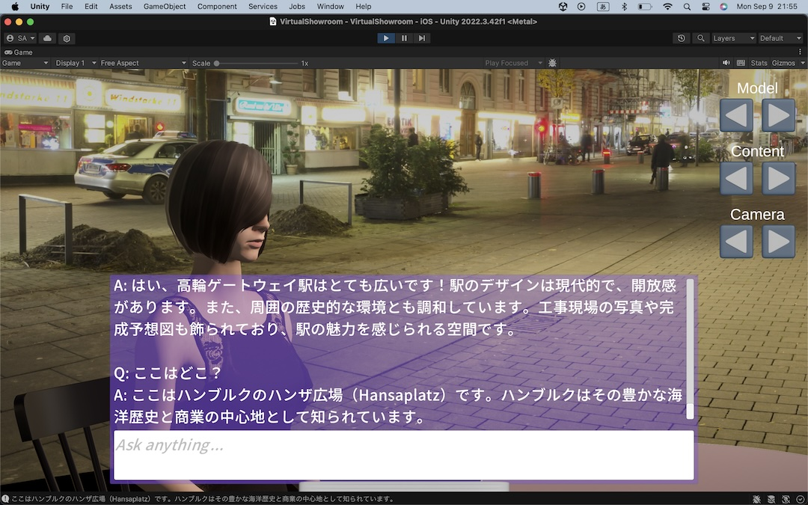

# AI-Controlled Virtual Showroom (Multimodal LLM use case)

Showrooms can be costly, but the cost-effectiveness is unclear. Therefore, companies generally aim to achieve semi-automation using AI.

## Experiment: ChatGPT can be a tour guide on its own without text-only RAG

<table>
  <tr>
    <td>
            
    </td>
    <td>
      
  </tr>
</table>


## Image-to-Text implementation

Chatting with images.

```
[Unity app] --- PUT request with query and base64-encoded image ---> [API Server] <--> [OpenAI API Service]
                 (Resized Texture2D data encoded into Base64)                           gpt-4o-mini model
```



## Lighting in the showroom controlled by commands from the OpenAI's LLM (gpt-4o-mini)

### Eight words describing mood

I asked ChatGPT:

```
Q: "Please provide eight words in English that describe the mood of photos of the city, port, or station,
including negative expressions."

A:
Serene (穏やか)
Bustling (賑やか)
Nostalgic (懐かしい)
Lonely (寂しい)
Picturesque (絵のように美しい)
Chaotic (混沌とした)
Gloomy (陰鬱な)
Vibrant (活気に満ちた)
```

So the prompt will be like
```
Please choose one word from the following options that best describes the mood of this photo.
If you are unsure, please respond with 'Unsure."

Options: Serene, Bustling, Nostalgic, Lonely, Picturesque, Chaotic, Gloomy, Vibrant.
```

Then I asked ChatGPT to express those words in the HTML color format.
```
Q: Please express "Serene" in HTML color format, such as #FFFFFF.
A: "Serene" can be represented by the HTML color #87CEEB, which is a calm and peaceful sky blue shade.

Q: Please express "Bustling" in HTML color format, such as #FFFFFF.
A: "Bustling" can be represented by the HTML color #FFA500, which is a vibrant orange shade, symbolizing energy and activity.

Q: Please express "Nostalgic" in HTML color format, such as #FFFFFF.
A: "Nostalgic" can be represented by the HTML color #F4A460, which is a warm, earthy sandy brown, evoking a sense of sentimental reflection and memories of the past.

Q: Please express "Lonely" in HTML color format, such as #FFFFFF.
A: "Lonely" can be represented by the HTML color #708090, which is a muted slate gray, reflecting a feeling of solitude and isolation.

Q: Please express "Picturesque" in HTML color format, such as #FFFFFF.
A. "Picturesque" can be represented by the HTML color #ADD8E6, which is a light blue shade, often associated with scenic, serene landscapes.

Q: Please express "Chaotic" in HTML color format, such as #FFFFFF.
A: "Chaotic" can be represented by the HTML color #8B0000, which is a dark red, symbolizing disorder, intensity, and confusion.

Q: Please express "Gloomy" in HTML color format, such as #FFFFFF.
A: "Gloomy" can be represented by the HTML color #2F4F4F, a dark slate gray that conveys a somber, melancholic mood.

Q: Please express "Vibrant" in HTML color format, such as #FFFFFF.
A: "Vibrant" can be represented by the HTML color #FF4500, which is a bright, fiery orange-red that conveys energy and liveliness.
```

-  `Serene`
-  `Bustling`
-  `Nostalgic`
-  `Lonely`
-  `Picturesque`
-  `Chaotic`
-  `Gloomy`
-  `Vibrant`

The result is very good. I respect ChatGPT!

The following is the implementation of lighting control by ChatGPT. It works very well!





## 240-degree panorama pictures cut out from HDRI pictures from PolyHaven

The resolution of the panorama pictures taken with iPhone SE: 16010 × 4100 pixels

The resolution of HDRI pictures from PolyHaven: 16384 × 8192 pixels

- Target width: 16384 * 240 / 360 pixels = 10923 pixels
- Target height: Target width * 4100 / 16010 pixels = 10923 * 4100 / 16010 = 2797 pixels

(Work in progress)

