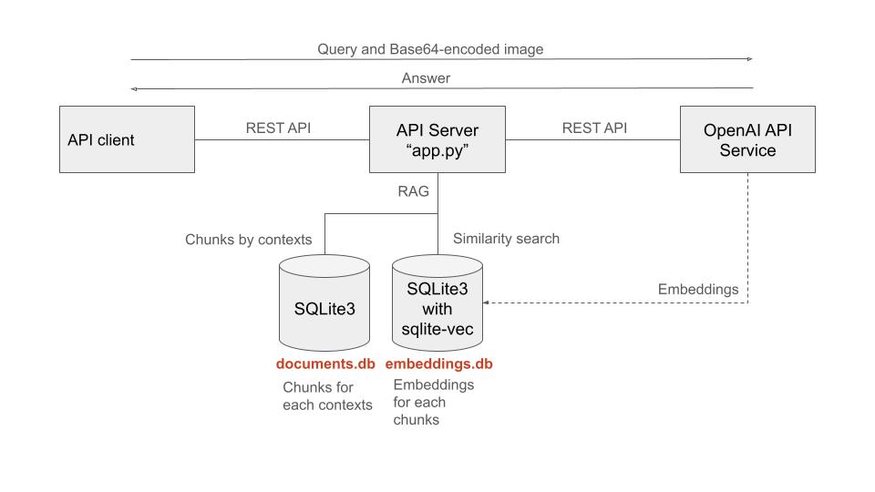
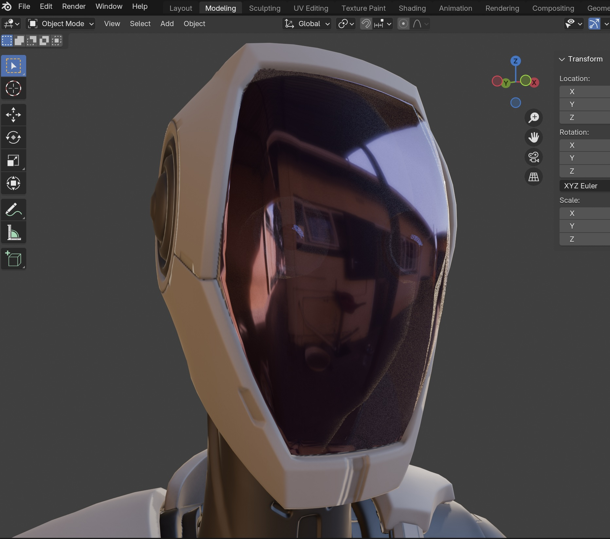

# Virtual Showroom

Note: I am not very good at English. This README.md was proofread by ChatGPT.

## Background

Showrooms can be costly, but their ROI is unclear. Therefore, companies generally aim to achieve semi-automation using Multimodal AI.

## Virtual Showroom Concept

The Virtual Showroom is highly cost-effective. It only requires a 240-degree panoramic screen to provide VR experiences without the need for headsets. I aspire to create a "real" virtual showroom at work someday, but for now, this project is focused on developing a "virtual" virtual showroom using Unity, either as an AR app or a console app, as part of my hobby project.

=> [Demo video on YouTube](https://youtu.be/bjNSUi2Oawk)

## Reference Showroom

I visited NISSAN GALLERY at [Nissan global headquarters](https://maps.app.goo.gl/Z5GTQqjRTFXAtd3D8) in Yokohama in March 2024. This was for a driving experience in harsh environments.

<table>
  <tr>
    <td>
            
    </td>
    <td>
      
    </td>    
  </tr>
</table>

## Schematic

My original design for a virtual showroom.

The 240-degree panoramic screen in this project also supports perspective drawing, similar to the driving experience at the NISSAN GALLERY mentioned above.

## System Architecture

The Flask-based API server runs on Raspberry Pi, suitable for home LAN environments.

## Development Environment

### Tools

- Blender with [MPFB2](https://static.makehumancommunity.org/mpfb.html) (Blender)
- Unity
- VS Code

### LLM

This project utilizes OpenAI's "gpt-4o-mini" with Multimodal RAG (text and image).

## Scenes

This project currently has two scenes:
- Virtual Showroom (it also runs as an AR app on a mobile phone)
- Object Detection

More scenes will be added in the future.

### Virtual Showroom scene

#### 1. Designing Models (Blender)

=> [MODELS.md](./MODELS.md)

#### 2. Creating the Virtual Showroom (Unity)

=> [SHOWROOM.md](./SHOWROOM.md)

#### 3. Developing the API server

The API server runs on Raspberry Pi.

Run the "app.py" that is in my another repo [compact-rag](https://github.com/araobp/compact-rag).

#### 4. AI-Controlled Virtual Showroom

=> [AI_Controlled.md](./AI_Controlled.md)

### Object Detection / image recognition scene

Although this scence has nothing to do with RAG, I use the Flask-based API server for simplicity.

#### AI Robot

I was impressed by [the demo video for Figure 01](https://www.figure.ai/). If such a robot were to exist, human guides in showrooms might no longer be necessary.

I modified the robot included in Unity's Starter Assets to experiment with what Generative AI can achieve.

<table>
  <tr>
    <td>
            
    </td>
    <td>
            
    </td>
    <td>
      
    </td>
  </tr>
</table>

#### Experiments

A few years ago, I developed several image recognition and object detection apps using TensorFlow like [this one](https://github.com/araobp/tower).

This time, I’m utilizing OpenAI's multimodal AI for image recognition and object detection.

I uploaded the experiment result to YouTube: [The experiment of multimodal AI with Unity](https://youtu.be/1yXJCsx69_0)

After trying various experiments, I found that an image size of at least 512px x 512px seems to work best.
