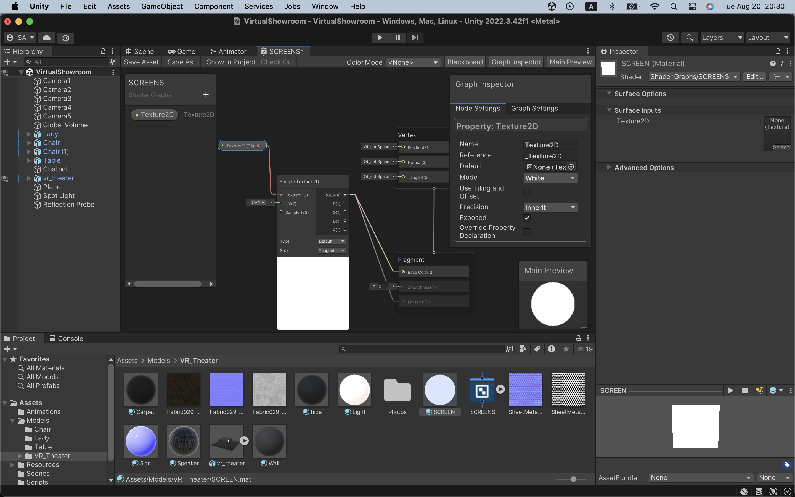

# Virtual Showroom

(Work in Progress)

## Goal

The goal is to realize a virtual showroom with Digital Human as promotional models.

This project uses human models made with Blender and MPFB2 to realize Digital Human.

The final output will be both a console app and an AR app on iOS.

The API server will run on PC or Mac. I will also test if it can also run on Raspberry Pi.

## Development Environment

### Tools

- Blender
- Unity
- VS Code

### Libraries

- [MPFB2](https://static.makehumancommunity.org/mpfb.html) (Blender)
- [LangChain](https://python.langchain.com/v0.2/docs/introduction/) and [OpenAI API](https://openai.com/index/openai-api/) (Python)
- [Flask](https://flask.palletsprojects.com/en/3.0.x/) (Python)

### LLM

This project uses "gpt-3.5-turbo" from OpenAI with RAG.

### Relevant projects (my other projects on github.com)

- https://github.com/araobp/blender-3d/tree/main/scenes/BluesHarp
- https://github.com/araobp/unity-ar
- https://github.com/araobp/learning-langchain

## Architecture

```
[DigitalHuman/Unity]--- REST API ---[ChatApp/LangChain/Flask]--- REST API ---[OpenAI API Services]
```

## Models

=> [MODELS.md](./MODELS.md)

## Virtual Showroom

### Screen shader made with Unity's Shader Graph

I have made my original shader for swapping images on the screen.



### Testing Chatbot animation on Unity 

I think 240-degree panorama screen is ideal for VR experiences with naked eyes at a showroom or an exhibition.

The background images are 240-degree panorama pictures taken with my iPhone SE.

https://github.com/user-attachments/assets/60e179d1-8ad3-498e-95d9-061d237fca20


