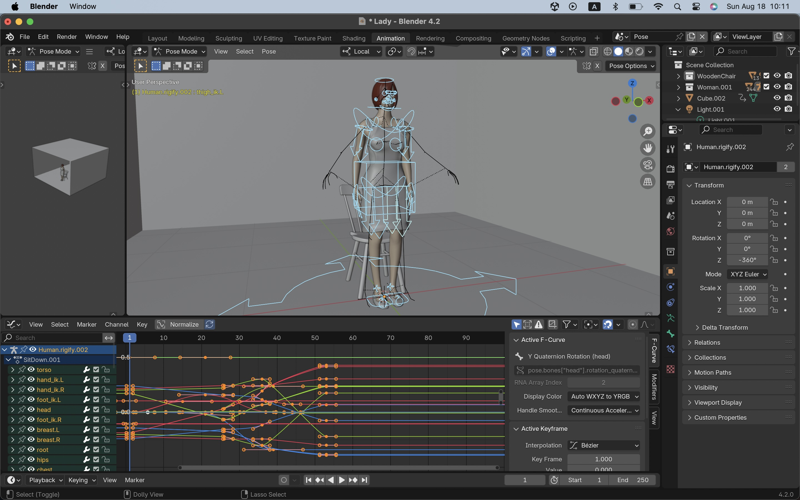
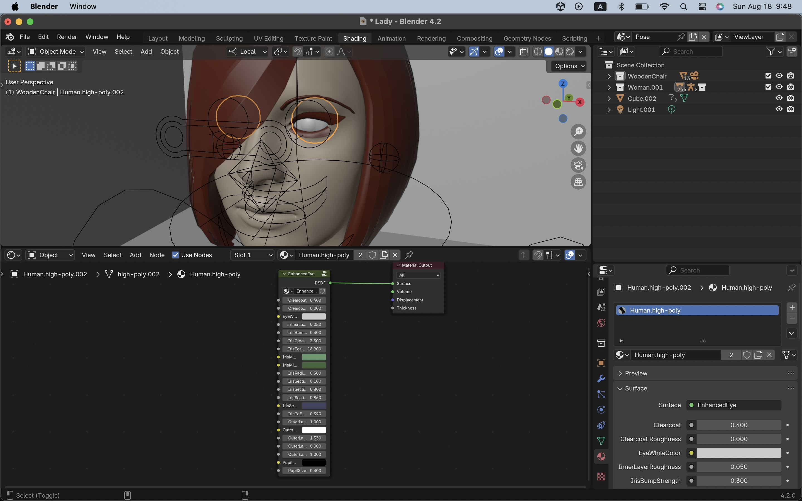
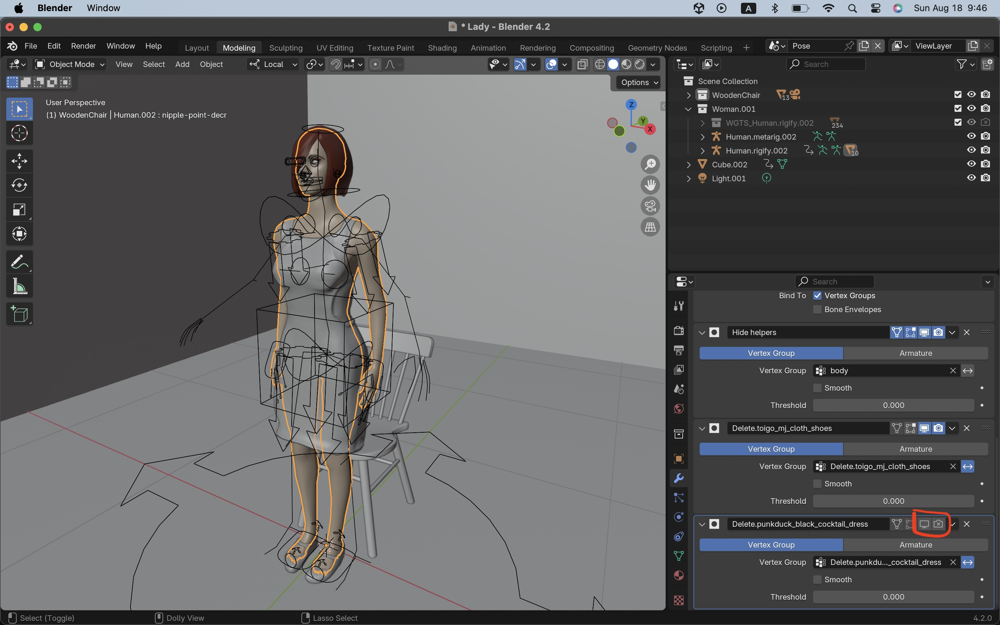
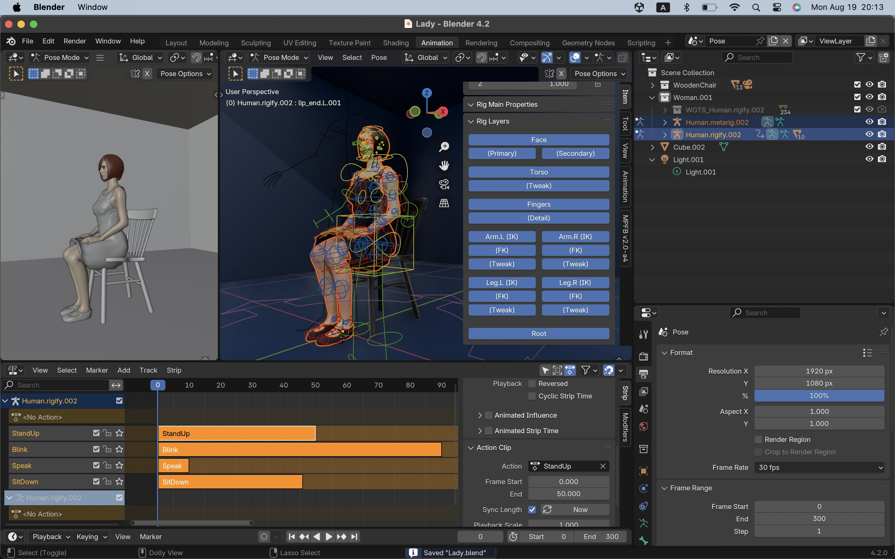
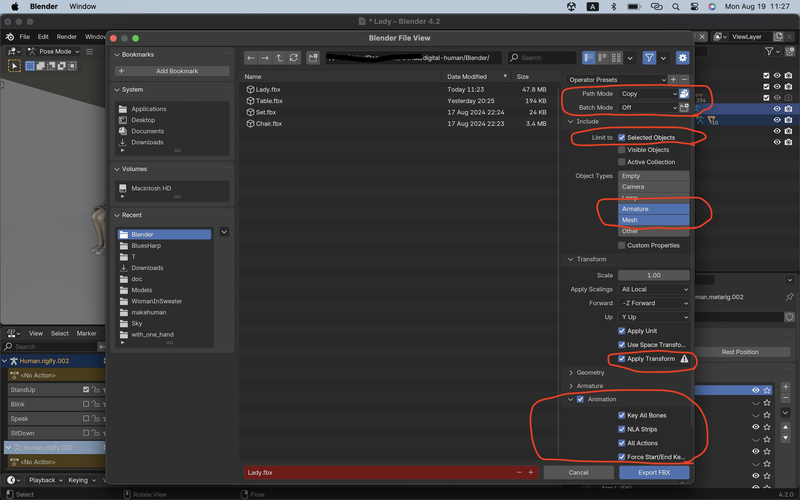

# Digital Human with LangChain

(Work in Progress)

## Goal

It is a dream from 25 years ago to realize Chatbot with humanity for me.

This project uses human models made with Blender and MPFB2 to realize Digital Human.

## Development Environment

### Tools

- Blender
- Unity
- VS Code

### Libraries

- [MPFB2](https://static.makehumancommunity.org/mpfb.html) (Blender)
- [LangChain](https://python.langchain.com/v0.2/docs/introduction/) and [OpenAI API](https://openai.com/index/openai-api/) (Python)
- [Flask](https://flask.palletsprojects.com/en/3.0.x/) (Python)

## Architecture

```
[DigitalHuman/Unity]--- REST API ---[ChatApp/LangChain/Flask]--- REST API ---[OpenAI API Services]
```

## Human model generated with Blender and MPFB2 (EEVEE NEXT with Ray Tracing enabled)


## Human model imported into Unity (URP)

Animations made on Blender works well on Unity.



https://github.com/user-attachments/assets/8bce04d2-df38-4438-85d2-9779e745b87d

## Blender MPFB => Unity Import Tips

### Eyes

The eye shader of MPFB2 is not compatible with Unity. Apply the eyes texture from MakeHuman to the shader instead.




### Body

The body generated with MPFB2 uses Blender's Active Modifer to remove a part of the body mesh under the cloth. On Unity, it causes a problem when the character wears a cloth with a diffuse texture having an Alpha channel. Just disable the modifer before exporting the model from Blender to Unity.



### Exporting the model to Unity

Select the model to be exported



Set the following options for exporting the model as FBX to Unity



## Testing Chatbot animation on Unity 

https://github.com/user-attachments/assets/e5bd0a7d-c31c-47b7-9a3e-1e007b13221e

https://github.com/user-attachments/assets/35e16adb-39e8-405c-887e-54834bb3df44
