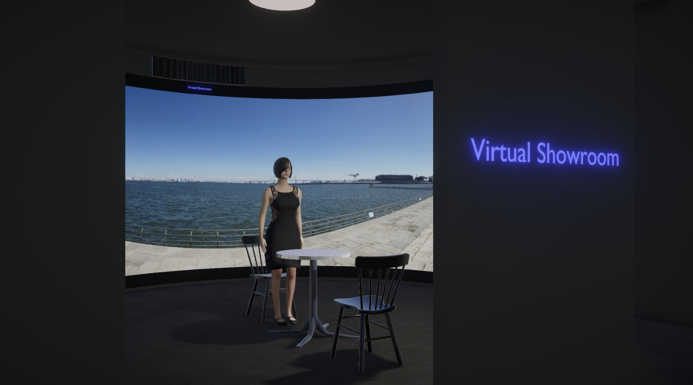

# Virtual Showroom

(Work in Progress)



## Goal

The goal is to realize a virtual showroom with Digital Human as promotional models.

## Virtual Showroom Concept

Virtual Showroom is a very cost-effective. It only requires a 240-degree panorama screen for VR experiences with naked-eyes. I want to realize a **"real"** virtual showroom someday at work, but this project develops a **"virtual"** virtual showroom running on Unity in the form of an AR app or a console app, as my hobby project.

## Schematic

My original design of such a virtual showroom.


## Reference Showroom

I visited NISSAN GALLERY at Nissan global headquarters in Yokohama in May 2024. This was for a driving experience in harsh environments.


## Architecture

```
[DigitalHuman/Unity]--- REST API ---[ChatApp/LangChain/Flask]--- REST API ---[OpenAI API Services]
```

The Flask-based API server will run on PC or Mac. I will also test if it can also run on Raspberry Pi.

## Development Environment

### Tools

- Blender
- Unity
- VS Code

### Libraries

- [MPFB2](https://static.makehumancommunity.org/mpfb.html) (Blender)
- [LangChain](https://python.langchain.com/v0.2/docs/introduction/) and [OpenAI API](https://openai.com/index/openai-api/) (Python)
- [Flask](https://flask.palletsprojects.com/en/3.0.x/) (Python)

### LLM

This project uses "gpt-3.5-turbo" from OpenAI with RAG.

## Models (Blender)

=> [MODELS.md](./MODELS.md)

## Virtual Showroom (Unity)

=> [SHOWROOM.md](./SHOWROOM.md)

## Relevant projects (my other projects on github.com)

- https://github.com/araobp/blender-3d/tree/main/scenes/BluesHarp
- https://github.com/araobp/unity-ar
- https://github.com/araobp/learning-langchain

