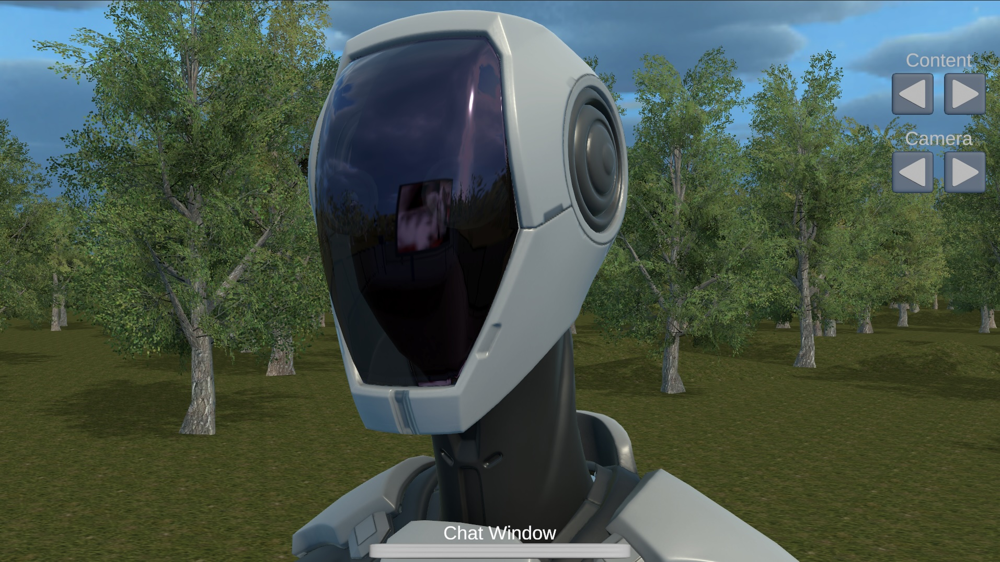

# Virtual Showroom

## Background

Showrooms can be costly, but their ROI is unclear. Therefore, companies generally aim to achieve semi-automation using Multimodal AI.

## Virtual Showroom Concept

Virtual Showroom is a very cost-effective. It only requires a 240-degree panorama screen for VR experiences with naked-eyes. I want to realize a **"real"** virtual showroom someday at work, but this project develops a **"virtual"** virtual showroom running on Unity in the form of an AR app or a console app, as my hobby project.

https://github.com/user-attachments/assets/a55178b7-909f-4702-ad78-8f9438cf234d

Althugh the video shows Japanese chat, ChatGPT is multilingual.

## Reference Showroom

I visited NISSAN GALLERY at [Nissan global headquarters](https://maps.app.goo.gl/Z5GTQqjRTFXAtd3D8) in Yokohama in May 2024. This was for a driving experience in harsh environments.

<table>
  <tr>
    <td>
            
    </td>
    <td>
      
    </td>    
  </tr>
</table>

## Schematic

My original design of such a virtual showroom.

The 240-degree panorama screen in this project also supports perspective drawing like a driving experience in NISSAN GARELLY above.

## AI Robot

I was moved by [the demo video fo Figure 01](https://www.figure.ai/).

I modify the robot included in the Unity's Starter Assets and use it to see what Generative AI can do.

<table>
  <tr>
    <td>
            
    </td>
  </tr>
  <td>
    
  </td>
</table>

## System Architecture

The Flask-based API server will run on PC or Mac. It can run on a virtual machine in the cloud as well.

## Development Environment

### Tools

- Blender
- Unity
- VS Code

### Libraries

- [MPFB2](https://static.makehumancommunity.org/mpfb.html) (Blender)
- [LangChain](https://python.langchain.com/v0.2/docs/introduction/) and [OpenAI API](https://openai.com/index/openai-api/) (Python)
- [Flask](https://flask.palletsprojects.com/en/3.0.x/) (Python)

### LLM

This project uses "gpt-4o-mini" from OpenAI with Multimodal RAG (text and image).

## Development

(Work in progress)

### 1. Designing Models (Blender)

=> [MODELS.md](./MODELS.md)

### 2. Creating Virtual Showroom (Unity)

=> [SHOWROOM.md](./SHOWROOM.md)

### 3. Developing API server (LangChain/Flask/Python)

=> [API_SERVER.md](./API_SERVER.md)

### 4. AI-Controlled Virtual Showroom

=> [AI_Controlled.md](./AI_Controlled.md)
