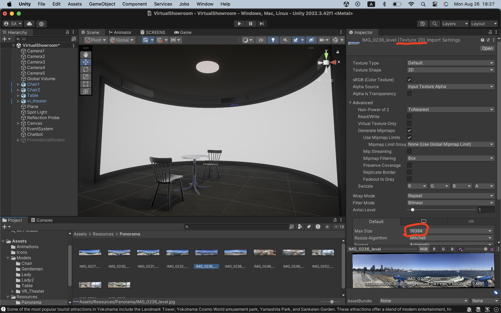
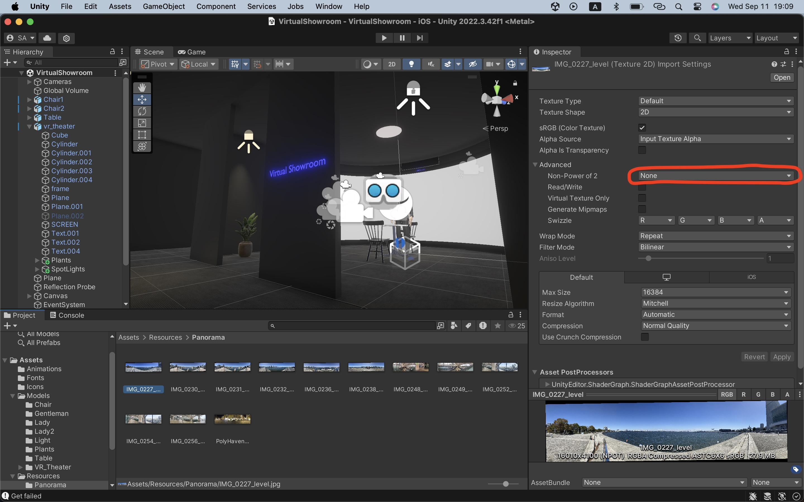
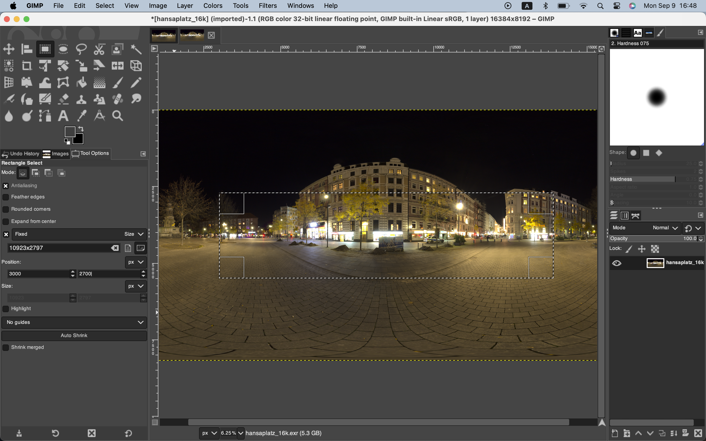
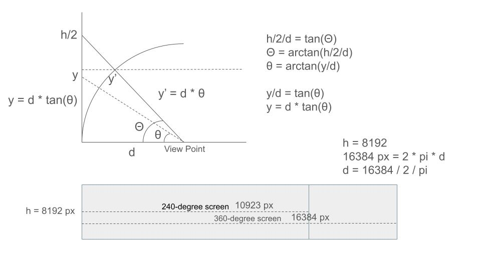
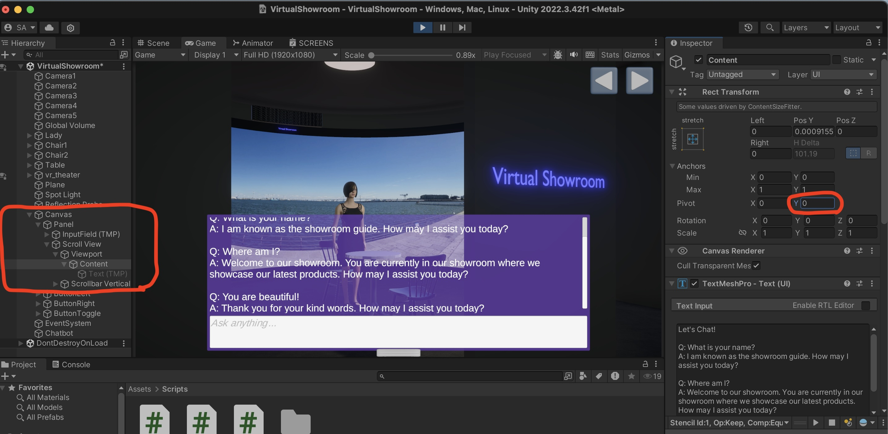
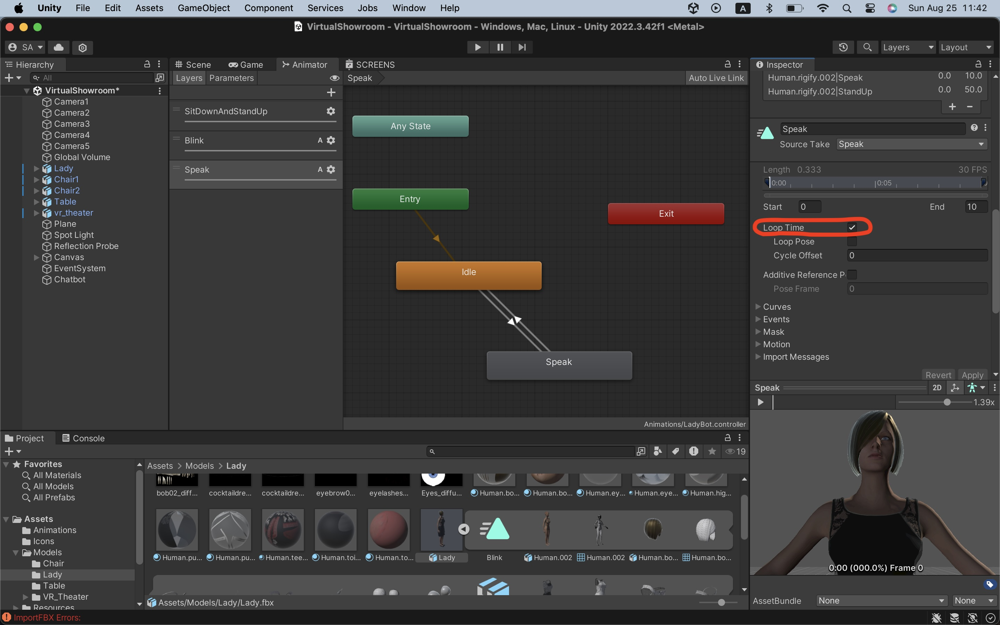

# Virtual Showroom

=> [Code](./VirtualShowroom)

## Screen shader made with Unity's Shader Graph

I have made my original shader for swapping images on the screen.

## Importing 240-degree photos into Unity as Texture 2D

I use my iPhone SE to caputre 240-degree panorama photos, then save them in the folder below.

Use a photo editor such as GIMP for horizontal adjustment if necessary.

Let's set them to 16k resolution for better photo quality.

Or set it to NPOT(non power of 2) if the GPU is powerful enough for rendering high-resolution images.

## Testing Chatbot animation on Unity 

I think 240-degree panorama screen is ideal for VR experiences with naked eyes at a showroom or an exhibition.

The background images are 240-degree panorama pictures taken with my iPhone SE.

https://github.com/user-attachments/assets/60e179d1-8ad3-498e-95d9-061d237fca20

## Running the app in AR mode

I run the app on my iOS devices such as iPad mini or iPhone SE.

Check "AR Mode" in the inspector window of "Chatbot" game object to run the app as a mobile AR app.

Uncheck "Auto Focus" in the inspector window below to stabilize the AR camera in a dark environment.

## 240-degree panorama pictures cut out from HDRI pictures from PolyHave

The resolution of the panorama pictures taken with iPhone SE: 16010 × 4100 pixels

The resolution of HDRI pictures from PolyHaven: 16384 × 8192 pixels

- Target width: 16384 * 240 / 360 pixels = 10923 pixels
- Target height: Target width * 4100 / 16010 pixels = 10923 * 4100 / 16010 = 2797 pixels

### Tentative solution

I used GIMP to cut out 240-degree panorama. The cut out image is distorted to some degree.

### Image correction with trigonometric functions and OpenCV

It is necessary to convert an Equirectangular projection image from PolyHaven to an cylindlical projection image.

Reference: 
- [(1) sphere2pano](https://paulbourke.net/panorama/sphere2pano/)
- [(2) image remap with OpenCV](https://github.com/araobp/blender-science/blob/main/Mathematics/opencv/remap.ipynb)

Unfortunately, the sphere2pano's source code is not free (1), so I have developed my own version based on my previous work (2) with the OpenCV's remap function.

=> [Sphere2Pano.ipynb](./Python/images/Sphere2Pano.ipynb)

The tool is also applicable to any sphere images in the Equirectangular format taken by 360 degree cameras.

## Tips

### Autscroll to bottom

The scrollbar in the Scrollview component should automatically scroll to the bottom.

Setting the pivot Y value to zero solves it.

### Animation loop

Check "Loop Time" for "Blink" and "Speak" animations to replay them in a loop.

## Credits

The plants in the scene were generated with Meshy under the CC BY 4.0 license.

- https://www.meshy.ai/
- https://docs.meshy.ai/
- https://docs.meshy.ai/faq

